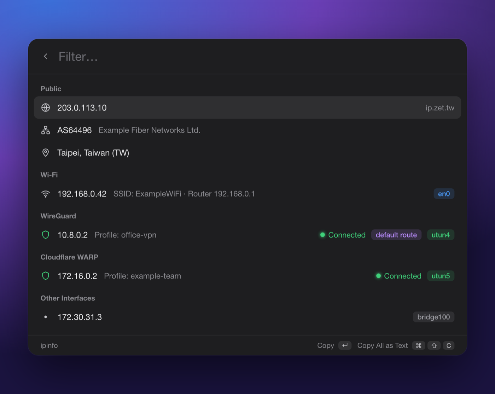

<p align="center">
  
</p>

<h1 align="center">ipinfo</h1>

<p align="center">
  Your public IP, every local address and which VPN is up — in one launcher command.<br>
  A <a href="https://www.raycast.com">Raycast</a> / <a href="https://github.com/abue-ammar/tinycast">Tinycast</a> extension for macOS.
</p>

<p align="center">
  <a href="https://github.com/zet235/ipinfo/actions/workflows/ci.yml"></a>
  
  
</p>

<p align="center">
  
  <br><sub>Example data.</sub>
</p>

## Features

- **Public** — IP, ASN + org, city/country from [ip.zet.tw](https://ip.zet.tw/json)
- **Wi-Fi** — IPv4, SSID and router
- **Ethernet** — IPv4 and router for every wired adapter
- **iPhone / iPad tethering** — USB or Bluetooth Personal Hotspot, with its router
- **VPN** — WireGuard, Cloudflare WARP (Zero Trust org), IPSec… with the profile name and a green **Connected** badge
- **Default route** — a tag on the interface your traffic actually leaves through
- **Other** — remaining interfaces with an IPv4 (unnamed `utun*`, VM `bridge*`, …)

- <kbd>↵</kbd> copies the highlighted value.
- <kbd>⌘</kbd><kbd>⇧</kbd><kbd>C</kbd> copies the whole screen as plain text:

```text
Public IP: 203.0.113.10
ASN: AS64496
Org: Example Fiber Networks Ltd.
Location: Taipei, Taiwan (TW)
Wi-Fi (en0): 192.168.0.42 [SSID ExampleWiFi, Router 192.168.0.1]
WireGuard (utun4): 10.8.0.2 [Profile office-vpn]
Cloudflare WARP (utun5): 172.16.0.2 [Profile example-team]
bridge100: 172.30.31.3
```

## Install

### Tinycast — from GitHub

This repository is a Tinycast registry (laid out like `raycast/extensions`, one folder per extension).

1. Settings → Extensions → Registries → **Add Registry…** → `https://github.com/zet235/ipinfo`
2. Install → search **ipinfo** → install. Tinycast downloads `extensions/ipinfo` and builds it locally.

To update, install it again from the same search.

### Raycast

Not published to the Raycast Store — install it from source:

```sh
git clone https://github.com/zet235/ipinfo.git
cd ipinfo/extensions/ipinfo
npm install
npx ray develop
```

Raycast imports the extension and opens it; search **ipinfo**. It stays installed after you stop
`ray develop` with <kbd>Ctrl</kbd>+<kbd>C</kbd>. To update, `git pull` and run `npx ray develop` again.

Alternatively, after `npm install`, run Raycast's **Import Extension** command and pick the
`extensions/ipinfo` folder.

### Tinycast — from source

```sh
git clone https://github.com/zet235/ipinfo.git
cd ipinfo/extensions/ipinfo
npm install
npm run build          # → build/
```

Settings → Extensions → Install → **Add Folder…** → `extensions/ipinfo/build`.

## How it works

Everything local comes from built-in macOS tools, run without a shell and without sudo:

| Data | Source |
|---|---|
| Interfaces + IPv4 | `/sbin/ifconfig` |
| Wi-Fi / Ethernet names | `/usr/sbin/networksetup -listallhardwareports` |
| SSID, router | `/usr/sbin/ipconfig getsummary <wifi>` |
| VPN profiles | `/usr/sbin/scutil --nc list` / `--nc status <id>` |
| System-extension tunnels (WARP) | `scutil` → `State:/Network/Service/*/IPv4` |
| Default route | `scutil` → `State:/Network/Global/IPv4` |
| Zero Trust org | `/usr/local/bin/warp-cli registration show` (optional) |

Each tool is called by absolute path with a 2 s hard timeout and a 1 MiB output cap, so a
wedged daemon can't freeze the launcher. Every lookup except `ifconfig` is best-effort: if
one fails, that detail is dropped and the rest still render.

## Privacy

- The only network request is `GET https://ip.zet.tw/json` (no cookies, no custom headers,
  redirects refused, body capped at 64 KiB).
- Nothing is written to disk, cached or logged; values reach the clipboard only when you copy.
- Control and bidi characters are stripped from every displayed or copied string, so a
  hostile SSID or GeoIP name can't smuggle escape sequences into your terminal.

## Development

```sh
cd extensions/ipinfo
npm test          # node --test — parsers run on captured fixtures, no network or root
npm run typecheck
npm run lint      # ray lint (one accepted warning: the lowercase `ipinfo` title)
npm run build
```

Requires Node 22.18+ (native TypeScript type stripping for the tests); CI runs on
macOS with Node 26.

```text
extensions/ipinfo/
  src/ipinfo.tsx       the List — layout only, the one file importing @raycast/api
  src/lib/public.ts    ip.zet.tw fetch + validation
  src/lib/local.ts     subprocess runner, parsers, interface/VPN detection
  src/lib/format.ts    rows and copy-all text (pure, sanitised)
  test/                node --test suites
media/                 README screenshot
```

## License

MIT
